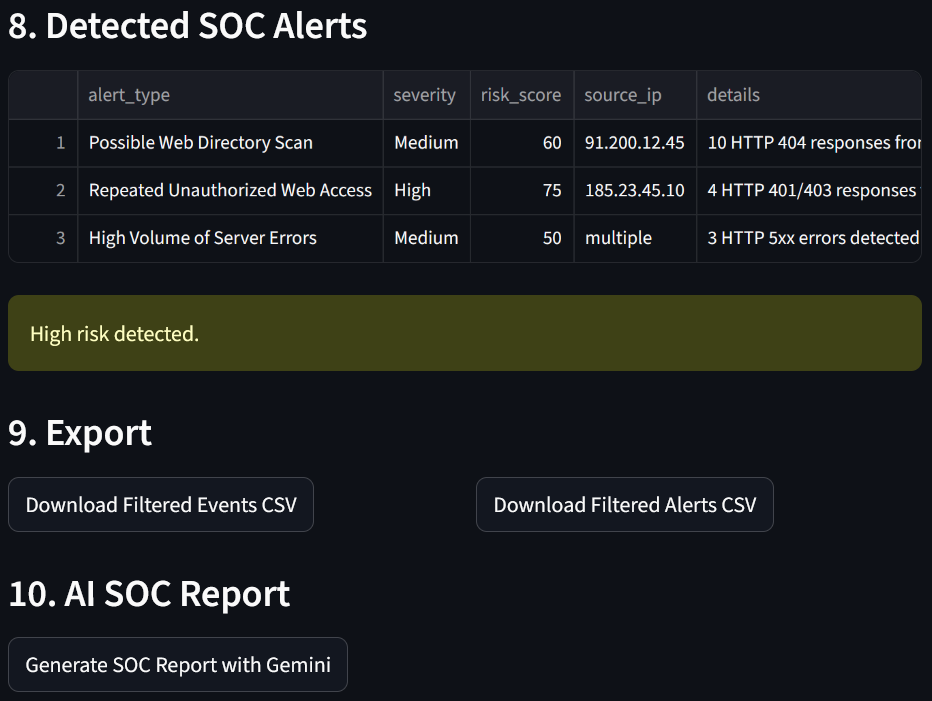

# AI SOC Log Analyzer

AI SOC Log Analyzer is a Streamlit application for analyzing security log files.

The application can ingest SSH, Apache, and firewall logs, detect suspicious activity using Python rules, assign risk scores, and generate SOC investigation reports with the Gemini API.

## Live Demo

Try the application here:

Open the Streamlit App :https://aisocloganalyzer-hebch2jh3r22kprafdadtk.streamlit.app/

## Features

- Upload `.log`, `.txt`, or `.csv` files
- Automatic log type detection
- SSH, Apache, and firewall log parsing
- Rule-based SOC alert detection
- Risk scoring
- Interactive Streamlit dashboard
- Filters by source IP, event type, and severity
- Executive summary
- CSV export
- Gemini-assisted SOC investigation report

## Detection Capabilities

### SSH Logs

- SSH brute-force attempts
- Root account targeting
- Successful login after multiple failures
- Invalid user attempts

### Apache Logs

- Web directory scanning
- Repeated unauthorized access
- High volume of server errors

### Firewall Logs

- Repeated blocked connections
- Possible port scanning

## Tech Stack

- Python
- Streamlit
- Pandas
- Regex
- Google Gemini API
- python-dotenv

## Project Structure

```text
ai_soc_log_analyzer/
├── data/
├── notebooks/
├── outputs/
├── src/
│   ├── app.py
│   ├── parsers.py
│   ├── detectors.py
│   └── gemini_report.py
├── config.env.example
├── requirements.txt
├── README.md
└── .gitignore
```

## Screenshots

### Dashboard Overview


### Alerts Detection


### AI SOC Summary


